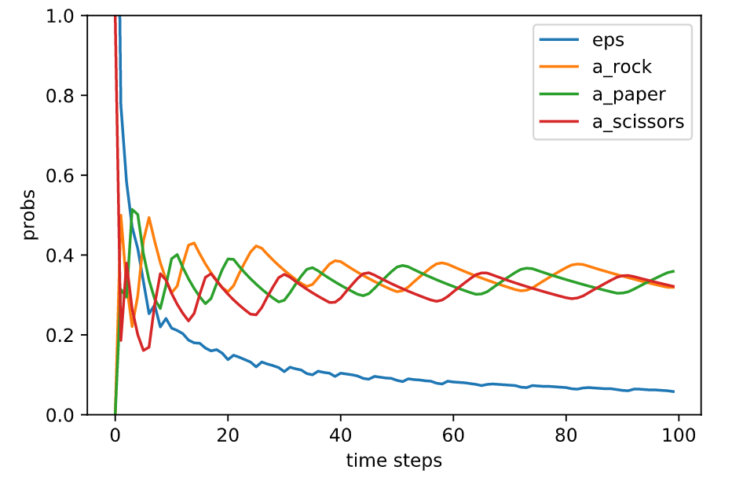
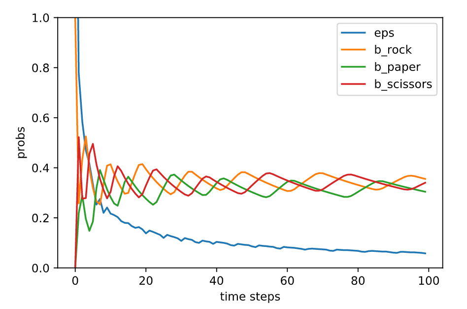

## Regret Matching for Rock-Paper-Scissors

Regret Matching algorithm for computing Rock-Paper-Scissors Nash Equilibrium

### Algorithm

**Regret Matching algorithm**  will maintain the **vector of weights assigned to experts** . After loss vector is revealed we can compute cumulative regret with respect to an expert  at time  (it expresses how we regret not listening particular expert ):

Having that, experts’ weights are updated with the formula:

and finally components of our vector  (a probability distribution vector over  experts) are given by:

<a href="https://www.codecogs.com/eqnedit.php?latex=p_i^t&space;=&space;\begin{cases}&space;w_{i,t}/\sum_{j&space;\in&space;N}{w_{j,t}}&space;&&space;{\rm&space;if}&space;\sum_{j&space;\in&space;N}{w_{j,t}}&space;>&space;0&space;\\&space;1/N&space;&&space;{\rm&space;otherwise}&space;\end{cases}" target="_blank">&space;0&space;\\&space;1/N&space;&&space;{\rm&space;otherwise}&space;\end{cases}" title="p_i^t = \begin{cases} w_{i,t}/\sum_{j \in N}{w_{j,t}} & {\rm if} \sum_{j \in N}{w_{j,t}} > 0 \\ 1/N & {\rm otherwise} \end{cases}" /></a>

You can find a more comprehensive explanation of this algorithm [here](https://int8.io/counterfactual-regret-minimization-for-poker-ai/).

### Uasge

Check `regret_matching.ipynb` for more infomation.

### Result

Both players find the Nash equilibrium of the game and play rock/paper/scissors with roughly the same probability.

<table>
<tr>
<td></td>
<td></td>
</tr>
<tr>
<th>strategy of player a</th>
<th>strategy of player b</th>
</tr>
</table>

